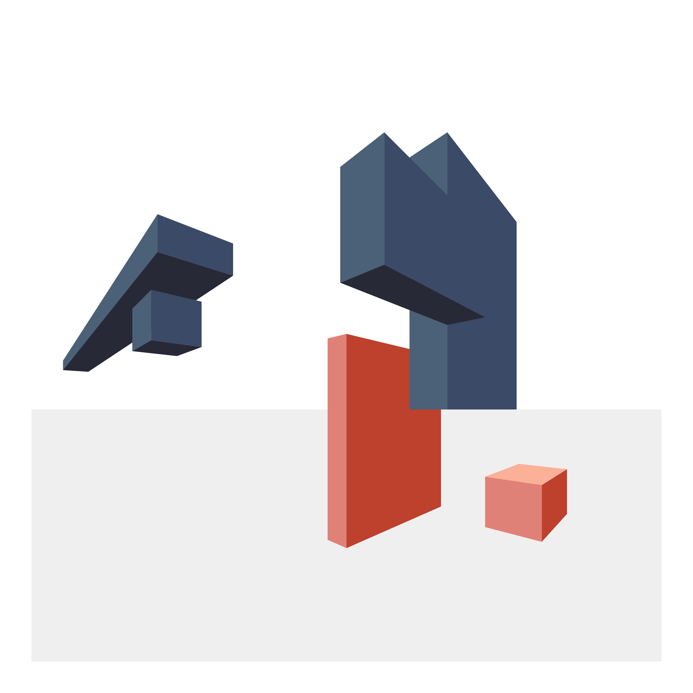
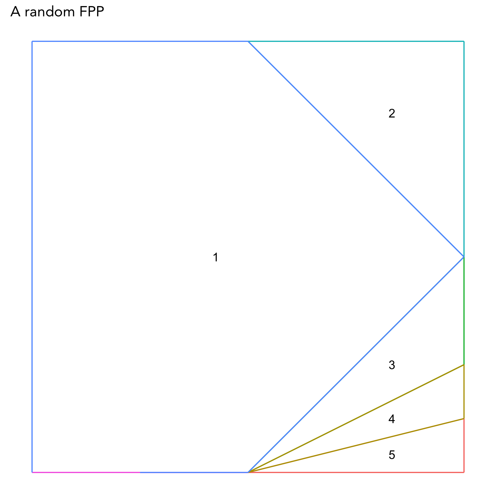

# quiltR

Code to design quilts in R. This is work in progress and is continually developing.

## Slides from RStudio::conf 2022 talk

To be added.

## 2-point perspective polygons

This code generates a landscape with a specified number of rectangular polygons.

See the [tutorial_polygons.Rmd](./how_to_run/tutorial_polygons.Rmd) Rmd and associated html.

## Random Foundation Paper piecing blocks

This code generates random foundation paper piecing (FPP) patterns
including the order to add the sections. Can use any starting shape
and be run recursively to create a large design with smaller blocks.

[wip/make_random_fpp.R](./wip/make_random_fpp.R) script.

I also started some code that takes some design features as input.
For example, if you have an input shape, you can generate the pattern 
to match it.

[wip/make_constrained_fpp.R](./wip/make_constrained_fpp.R) script.

## Overlapping circles quilt

This code is relatively simple. It generates images with intersecting
circles just using ggplot2. The [tutorial_circles.Rmd](./how_to_run/tutorial_circles.Rmd) 
Rmd and associated html walk through my logic and estimates for fabric needed, etc.

## Using an image as a starting point

Code to take a photo (or image like an ombre color fade) and separate in to blocks for piecing.

[wip/design_from_image.R](./wip/design_from_image.R) script.

## Support for splitting a design into blocks

For one example, see the [tutorial_polygons.Rmd](./how_to_run/tutorial_polygons.Rmd) 
section on creating individual blocks.

## Support for choosing colors

This is a work in progress. Some data on the colors available in Kona cotton
or Art Gallery Fabrics is in [colors]("./colors").

There is also a script, [wip/matching_color_fabrics.R](./wip/matching_color_fabrics.R) 
that attempts to find closest match to a given color.

## Notes

Also documented at <https://awalsh17.github.io/posts/2022-03-24-quilting-with-r/>

For more on foundation paper piecing, see <https://web.stanford.edu/~mleake/projects/paperpiecing/>

